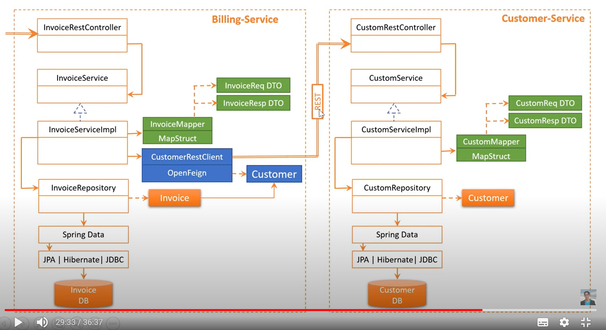
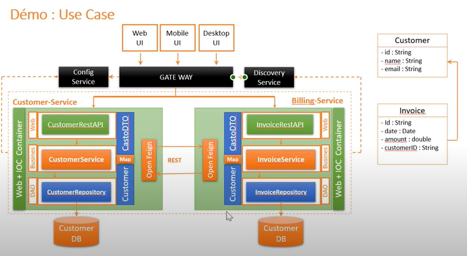
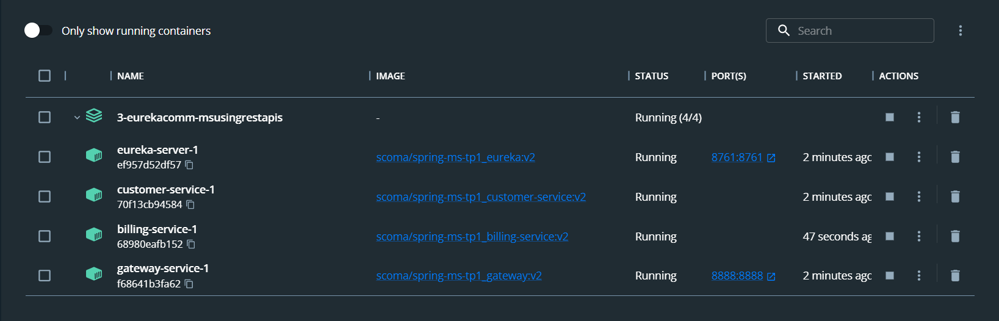
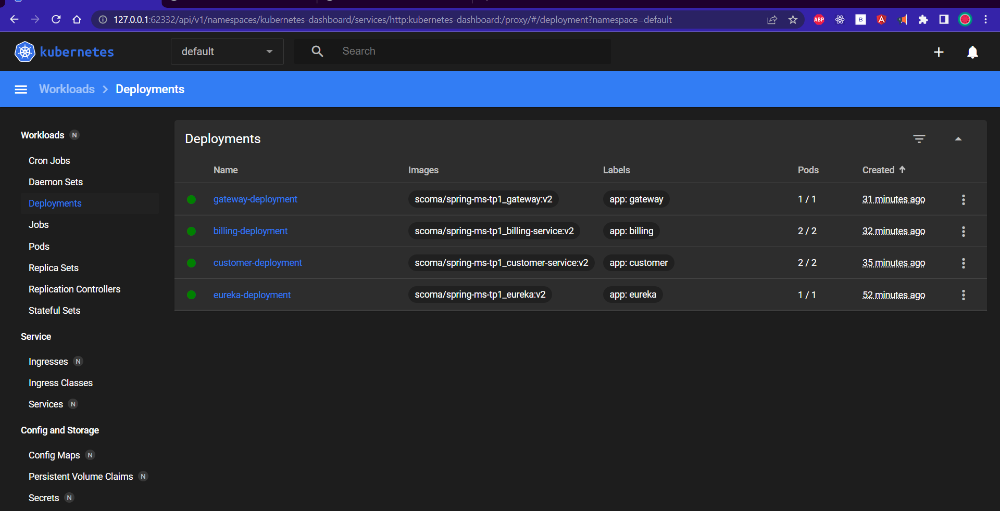
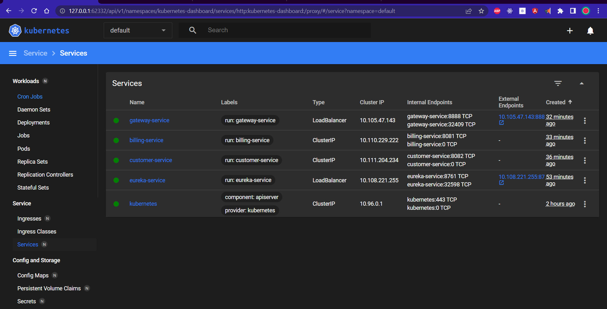
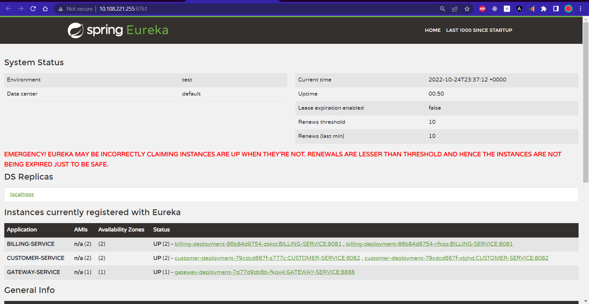
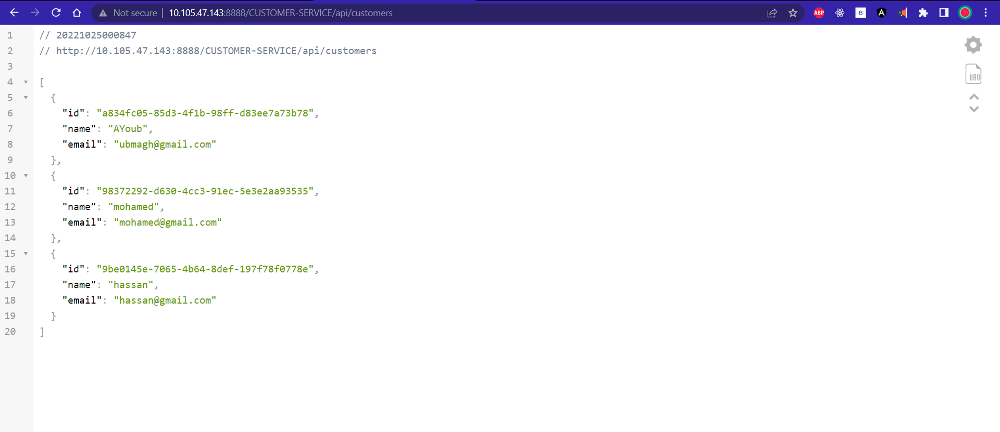

> this repo was derived/separated from [This one](https://github.com/ubmagh/springboot-microservices), check it for older commits.


# Communicating microservices using eureka (REST apis) With  a gateway
 
## Quick notes

> for this project, you'll have to start these apps in the order : eureka server -> customer-service -> billing-service -> gateway. <br> this is because the billing service needs to query some data from customer service, and both of them need to be registered on eureka.

⭐ have a look on exceptions management and Http codes returning.

<br>

##  Project architecture : 



<br>



<br>
<br>

# Project repport

## Creating microservices 

[👉 Creating Eureka discovery service/micro-service (& dockerizing it)](./eureka-discovery-service/)


[👉 Creating Customer micro-service (& dockerizing it)](./customer-service/)


[👉 Creating Billing micro-service (& dockerizing it)](./billing-service/)


[👉 Creating GateWay micro-service (& dockerizing it)](./gateway/)


<br>

## Running microservices on docker compose :

The [Docker-compose.yaml](./Docker-compose.yaml) is configured properly to run all the microservices together, note that microservices `CUSTOMER-SERVICE` and `BILLING-SERVICE` are not accessible directly, you need either to uncomment port mapping or pass through gateway, ex : http://localhost:8888/CUSTOMER-SERVICE/api/customers

> `docker-compose up`

* running containers : 

<p align="center">
    
</p>

* eureka on `http://localhost:8761` : 

<p align="center">
    
</p>

* test billing api on `http://localhost:8888/BILLING-SERVICE/api/invoices` : 

<p align="center">
    
</p>

<br>
<br>

## Running microservices on kubernetes (K8s) :

<br>

> if you're working with minikube you may need to pull images locally first example `minikube image pull scoma/spring-ms-tp1_billing-service:v2` 

> after staring the k8s cluster i applied these config files in order to create  : 
```
$ kubectl apply -f .\k8s-eureka.yaml
$ kubectl apply -f .\k8s-customer.yaml
$ kubectl apply -f .\k8s-billing.yaml
$ kubectl apply -f .\k8s-gateway.yaml

#   => to create 
# {
#  1: eureka pod
#  1: gateway pod
#  2: customer pods
#  2: billing pods
# }
```
[> .\k8s-eureka.yaml](.\k8s-eureka.yaml)

[> .\k8s-customer.yaml](.\k8s-customer.yaml) 

[> .\k8s-billing.yaml](.\k8s-billing.yaml) 

[> .\k8s-gateway.yaml](.\k8s-gateway.yaml) 

<br>

<p align="center">
    
</p>

> I've set `customer` and `billing` pods on an internal network so that access can be done only through the `gateway`

<p align="center">
    
</p>


> to get access to the `gateway` service i ran the command `minikube tunnel`, then i had access to eureka published services

<p align="center">
    
</p>

> * this is a test of GET:/customers list api through the gateway : 

<p align="center">
    
</p>


<br>
<br>

## Project deep explanation (in french)  :

https://www.youtube.com/watch?v=tpCIvZ5QSAs

https://www.youtube.com/watch?v=-fzjrCjTZ6o

https://www.youtube.com/watch?v=_f-LS0Z2CTM

https://www.youtube.com/watch?v=fXYlKpI_XNk

https://www.youtube.com/watch?v=XRUf6k6YCzA

<br>

> end .<