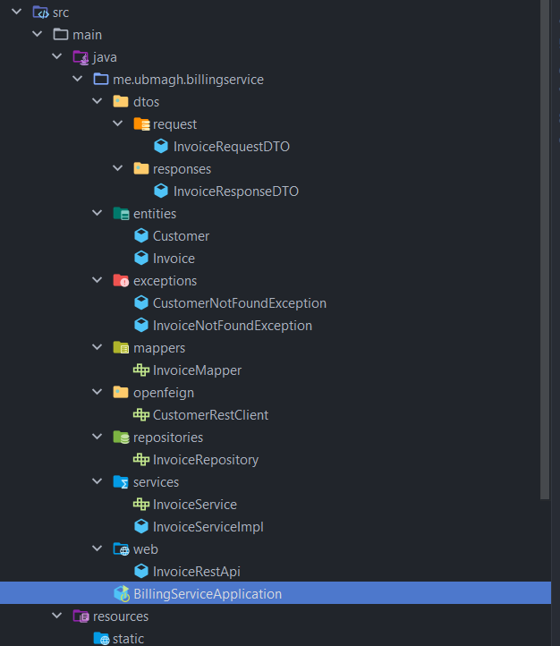

[👈 go back](./..)

# Create Billing/invoices micro-service

<br>

## Stack & packages :

```
java : 17-Maven
spring : 2.7.5
packages : 
    - spring cloud : 2021.0.4
    - spring-boot-starter-data-jpa
    - spring-cloud-starter-netflix-eureka-client
    - spring-cloud-starter-openfeign
    - com.h2database/h2
    - spring-boot-starter-web
    - org.mapstruct/mapstruct-processor : 1.5.3.Final
    - org.projectlombok/lombok : 1.18.24
    - org.springdoc/springdoc-openapi-ui : 1.6.11
```
-> Have a look : [📦 pom.xml ](./pom.xml)

<br>

## Config : 

### -> Project configuration : `application.properties`

```
eureka.instance.prefer-ip-address=true
server.port=8081
spring.application.name=BILLING-SERVICE
spring.h2.console.enabled=true
spring.cloud.discovery.enabled=true
spring.datasource.url=jdbc:h2:mem:billingdb
springdoc.swagger-ui.path=/swagger-ui.html
```
[⚙ application.properties ](./src/main/resources/application.properties)

<br>

## Application : 

### ℹ Project structure ; 

<p align="center">
    
</p>

<br>

### 💻 Data Layer : 

* one single data-jpa entity : `~/entities/Invoice` 

```
@Data
@Entity
@AllArgsConstructor
@NoArgsConstructor
@Builder
public class Invoice {

    @Id
    private String id;
    private Date date;
    private BigDecimal amount;
    private String cusomerId;

    @Transient
    private Customer customer;
}
```

* with another non data-jpa entity : `~/entities/Customer` 

```
@Data
public class Customer {

    private String id;
    private String name;
    private String email;
}
```


* One single repository (interface) : `~/repositories/InvoiceRepository`

```
@Repository
public interface InvoiceRepository extends JpaRepository< Invoice, String> {
    List<Invoice> findByCusomerId( String customerId);
}
```
<br>


### 🔁 BusinessLogic Layer : 

<br>

#### 1. services : 

* Customer service interface : `~/services/InvoiceService.java` : 
```
@Service
public interface InvoiceService {

    InvoiceResponseDTO saveInvoice(InvoiceRequestDTO invoiceRequestDTO) throws CustomerNotFoundException;
    InvoiceResponseDTO getInvoice( String Id) throws InvoiceNotFoundException;
    List<InvoiceResponseDTO> invoicesByCustomer(String customerId) throws CustomerNotFoundException;
    List<InvoiceResponseDTO> getAllInvoices();
}
```
-> [implmentation of the interface : `InvoiceServiceImpl` ](./src/main/java/me/ubmagh/billingservice/services/InvoiceServiceImpl.java)

<br>

#### 2. DTOs : 

> There are two DTOs kinds, for responses & for requests : 

* request dto : `~/dtos/requests/InvoiceRequestDTO.java` : 
```
@Data
@AllArgsConstructor
@NoArgsConstructor
@Builder
public class InvoiceRequestDTO {
    private BigDecimal amount;
    private String cusomerId;
}
```

* response dto : `~/dtos/responses/InvoiceResponseDTO.java` : 
```
@Data
@AllArgsConstructor
@NoArgsConstructor
@Builder
public class InvoiceResponseDTO {
    private String id;
    private Date date;
    private BigDecimal amount;
    private Customer customer;
}
```

<br>

#### 3. Mappers : 

* a mapstruct mapper : `~/mappers/InvoiceMapper.java`

```
@Mapper(componentModel = "spring")
public interface InvoiceMapper {
    Invoice fromInvoiceRequestDTO(InvoiceRequestDTO invoiceRequestDTO);
    InvoiceResponseDTO fromInvoice(Invoice invoice);
}
```

<br>

#### 4. Exceptions :

* A customer not found exception : `~/exceptions/CustomerNotFoundException.java`

```
public class CustomerNotFoundException extends RuntimeException{
    private String customerId;
    public CustomerNotFoundException(String customerId ){
        super("Customer not found !");
        this.customerId = customerId;
    }
    public String getCustomerId() {
        return customerId;
    }
}
```

* And invoice not found exception : `~/exceptions/InvoiceNotFoundException.java`

```
public class InvoiceNotFoundException extends RuntimeException{
    private String invoiceId;
    public InvoiceNotFoundException(String invoiceId ){
        super("Invoice not found !");
        this.invoiceId = invoiceId;
    }
    public String getInvoiceId() {
        return invoiceId;
    }
}
```

<br>

#### 5. Open Feign Client :

* in order to fetch customers data from `CUSTOMER-SERVICE`, i've created this openfeign interface whit the ability to call two apis : `~/openfeign/CustomerRestClient` 

```
@FeignClient(name = "CUSTOMER-SERVICE")
public interface CustomerRestClient {
    @GetMapping(path = "/api/customers/{id}")
    Customer getCustomer( @PathVariable String id);

    @GetMapping(path = "/api/customers")
    List<Customer> getCustomersList();
}
```

<br>


### 🌐 Web Layer : 

* Web rest controller :  `~/web/InvoiceRestApi.java`

```
@RestController
@RequestMapping("/api")
@AllArgsConstructor
public class InvoiceRestApi {

    private InvoiceService invoiceService;

    @GetMapping("/health-beat")
    public String checkHealth(){
        return "Healthy Beat @BillingSvc";
    }

    @GetMapping("/invoices/{id}")
    public InvoiceResponseDTO getInvoice( @PathVariable String invoiceId){
        InvoiceResponseDTO invoice;
        try{
            invoice = invoiceService.getInvoice(invoiceId);
        }catch (InvoiceNotFoundException exc){
            throw new ResponseStatusException( HttpStatus.NOT_FOUND, "Invoice with id: "+exc.getInvoiceId()+" was not found !" );
        }
        return invoice;
    }


    ....


    @PostMapping("/invoices")
    public InvoiceResponseDTO createInvoice(@RequestBody InvoiceRequestDTO invoice){
        InvoiceResponseDTO invoiceResp;
        try{
            invoiceResp = invoiceService.saveInvoice(invoice);
        }catch ( CustomerNotFoundException exc){
            throw new ResponseStatusException( HttpStatus.BAD_REQUEST, "Customer with id: "+exc.getCustomerId()+" was not found !" );
        }
        return invoiceResp;
    }

    @GetMapping("/invoices")
    public List<InvoiceResponseDTO> getInvoices(){
        return invoiceService.getAllInvoices();
    }

    @ExceptionHandler(ResponseStatusException.class)
    public ResponseEntity<String> exceptionHandler( ResponseStatusException exc){
        return new ResponseEntity<>(exc.getReason(), exc.getStatus() );
    }
}
```
-> [Full code](./src/main/java/me/ubmagh/billingservice/web/InvoiceRestApi.java)

<br>


### 🚀 main application : 

* Main app class `~/BillingServiceApplication.java` contains along with server launch, a bean to insert some data to the H2 database and the annotation `@EnableFeignClients` to be able to use Feign :


```
@SpringBootApplication
@EnableFeignClients
public class BillingServiceApplication {

    public static void main(String[] args) {
        SpringApplication.run(BillingServiceApplication.class, args);
    }

    @Bean
    CommandLineRunner start(InvoiceService invoiceService, CustomerRestClient customerRestClient){
        List<Customer> customers = customerRestClient.getCustomersList();
        return args -> {
            for ( Customer customer:customers) {
                for( int i=0; i<(Math.random()*33)%5; i++)
                    invoiceService.saveInvoice( new InvoiceRequestDTO( BigDecimal.valueOf(Math.random()*777), customer.getId() ));
            }
        };
    }
}
```

<br>

## Test locally : 


```
steps : 
    1. launch eureka service
    2. launch customer service
    3. launch this app ; billing
```

* published on eureka discovery : 

<p align="center">
    
</p>


* Swagger docs : 

<p align="center">
    
</p>

* example api call : 

<p align="center">
    
</p>

<br>
<br>

# dockerize it : 

[-> Docker file ](./Dockerfile)


> After packaging the app, you can build quicky with the command : ` sh ./Dockerize.sh `

```
FROM openjdk:17.0.2

# you need to compile & package your app before building a docker image !

ENV APP_HOME=/usr/app
WORKDIR $APP_HOME
COPY ./target/*.jar app.jar
EXPOSE 8081
CMD [ "java", "-jar", "app.jar"]
```

<p align="center">
    
</p>

[image on DockerHub](https://hub.docker.com/r/scoma/spring-ms-tp1_billing-service)


<br>

```< end.```