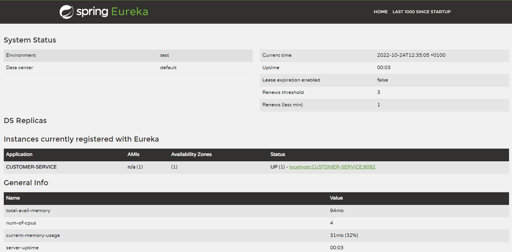
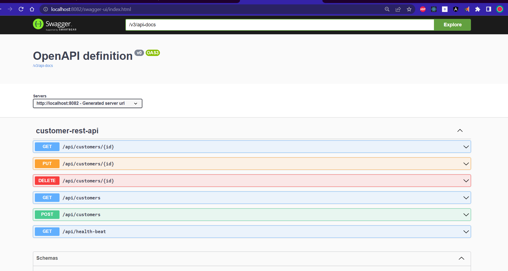
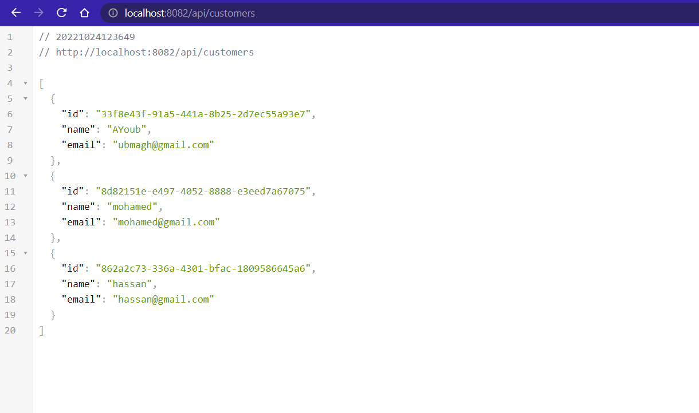
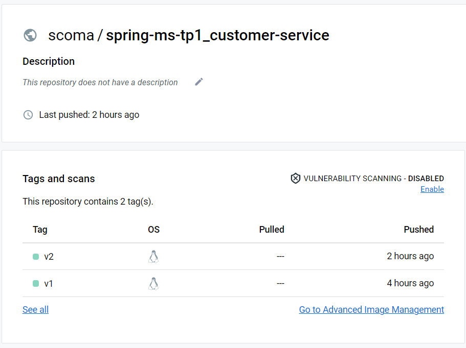

[👈 go back](./..)

# Create customer micro-service

<br>

## Stack & packages :

```
java : 17-Maven
spring : 2.7.5
packages : 
    - spring cloud : 2021.0.4
    - spring-boot-starter-data-jpa
    - spring-cloud-starter-netflix-eureka-client
    - com.h2database/h2
    - spring-boot-starter-web
    - org.mapstruct/mapstruct-processor : 1.5.3.Final
    - org.projectlombok/lombok : 1.18.24
    - org.springdoc/springdoc-openapi-ui : 1.6.11
```
-> Have a look : [📦 pom.xml ](./pom.xml)

<br>

## Config : 

### -> Project configuration : `application.properties`

```
eureka.instance.prefer-ip-address=true
server.port=8082
spring.application.name=CUSTOMER-SERVICE
spring.h2.console.enabled=true
spring.cloud.discovery.enabled=true
spring.datasource.url=jdbc:h2:mem:customerdb
springdoc.swagger-ui.path=/swagger-ui.html
```
[⚙ application.properties ](./src/main/resources/application.properties)

<br>

## Application : 

### ℹ Project structure ; 

<p align="center">
    
</p>

<br>

### 💻 Data Layer : 

* one single entity : `Customer` :

```
/* in : ~/entities/Customer.java  */
@Entity
@Data
@AllArgsConstructor
@NoArgsConstructor
@Builder
public class Customer {
    @Id
    private String id;
    private String email;
    private String name;
}
```

* One single repository (interface) : `CustomerRepository`

```
/* in : ~/repositories/CustomerRepository.java  */

@Repository
public interface CustomerRepository extends JpaRepository<Customer, String> {
}
```
<br>


### 🔁 BusinessLogic Layer : 

<br>

#### 1. services : 

* Customer service interface : `~/services/CustomerService.java` : 
```
@Service
public interface CustomerService {
    public CustomerResponseDTO saveCustomer(CustomerRequestDTO customerRequestDTO);
    public CustomerResponseDTO getCustomer( String customerId) throws CustomerNotFoundException;
    public CustomerResponseDTO updateCustomer( String customerId, CustomerRequestDTO customerRequestDTO) throws CustomerNotFoundException;
    public void deleteCustomer( String customerId);
    public List<CustomerResponseDTO> listCustomers();
}
```
-> [implmentation of the interface : `CustomerServiceImpl` ](./src/main/java/me/ubmagh/ap1/services/CustomerServiceImpl.java)

<br>

#### 2. DTOs : 

> There are two DTOs kinds, for responses & for requests : 

* request dto : `~/dtos/requests/CustomerRequestDTO.java` : 
```
@Data
@NoArgsConstructor
@AllArgsConstructor
public class CustomerRequestDTO {
    private String id;
    private String name;
    private String email;
}
```

* response dto : `~/dtos/responses/CustomerResponseDTO.java` : 
```
@Data
@NoArgsConstructor
@AllArgsConstructor
public class CustomerResponseDTO {
    private String id;
    private String name;
    private String email;
}

```

<br>

#### 3. Mappers : 

* a mapstruct mapper : `~/mappers/CustomerMapper.java`

```
@Mapper(componentModel = "spring")
public interface CustomerMapper {
    CustomerResponseDTO customerToCustomerResponseDTO(Customer customer);
    Customer customerRequestDtoToCustomer(CustomerRequestDTO customerReqDto);
}
```

<br>

#### 4. Exceptions :

* one single exception for a not found customer : `~/exceptions/CustomerNotFoundException.java`

```
public class CustomerNotFoundException extends RuntimeException{
    private String customerId;
    public CustomerNotFoundException(String customerId){
        super("Customer not found");
        this.customerId = customerId;
    }

    public String getCustomerId() {
        return customerId;
    }
}
```


<br>


### 🌐 Web Layer : 

* Web rest controller :  `~/web/CustomerRestApi.java`

```
@RestController
@RequestMapping("/api")
@AllArgsConstructor
public class CustomerRestApi {

    private CustomerService customerService;

    @GetMapping("/health-beat")
    public String checkHealth(){
        return "Healthy Beat @CustomerSvc";
    }

    @GetMapping("/customers")
    public List<CustomerResponseDTO> customersList(){
        return this.customerService.listCustomers();
    }

    @PostMapping("/customers")
    public CustomerResponseDTO saveCustomer(CustomerRequestDTO customerRequestDTO) {
        return this.customerService.saveCustomer(customerRequestDTO);
    }

    ....
}
```
-> [Full code](./src/main/java/me/ubmagh/ap1/web/CustomerRestApi.java)

<br>


### 🚀 main application : 

* Main app class `~/Ap1Application.java` contains along with server launch, a bean to insert some data to the H2 database :


```
@SpringBootApplication
public class Ap1Application {

    public static void main(String[] args) {
        SpringApplication.run(Ap1Application.class, args);
    }

    @Bean
    CommandLineRunner start(CustomerService customerService){
        return args -> {
            customerService.saveCustomer( new CustomerRequestDTO( "", "AYoub", "ubmagh@gmail.com") );
            customerService.saveCustomer( new CustomerRequestDTO( "", "mohamed", "mohamed@gmail.com") );
            customerService.saveCustomer( new CustomerRequestDTO( "", "hassan", "hassan@gmail.com") );
        };
    }
}
```

<br>

## Test locally : 


```
steps : 
    1. launch eureka service
    2. launch this app
```

* published on eureka discovery : 

<p align="center">
    
</p>


* Swagger docs : 

<p align="center">
    
</p>

* example api call : 

<p align="center">
    
</p>

<br>
<br>

# dockerize it : 

[-> Docker file ](./Dockerfile)


> After packaging the app, you can build quicky with the command : ` sh ./Dockerize.sh `

```
FROM openjdk:17.0.2

# you need to compile & package your app before building a docker image !

ENV APP_HOME=/usr/app
WORKDIR $APP_HOME
COPY ./target/*.jar app.jar
EXPOSE 8082
CMD [ "java", "-jar", "app.jar"]
```

<p align="center">
    
</p>

[image on DockerHub](https://hub.docker.com/r/scoma/spring-ms-tp1_customer-service)


<br>

```< end.```