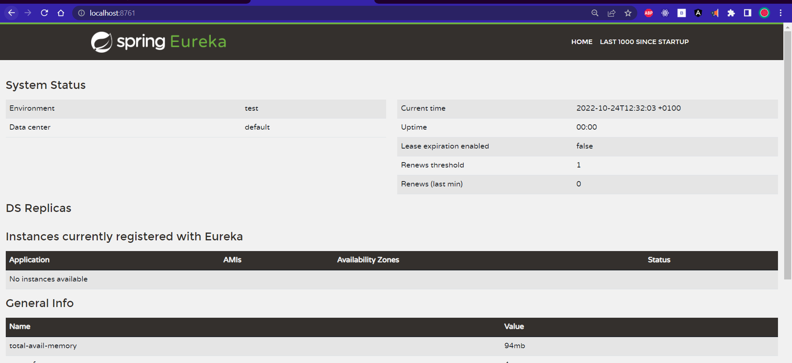
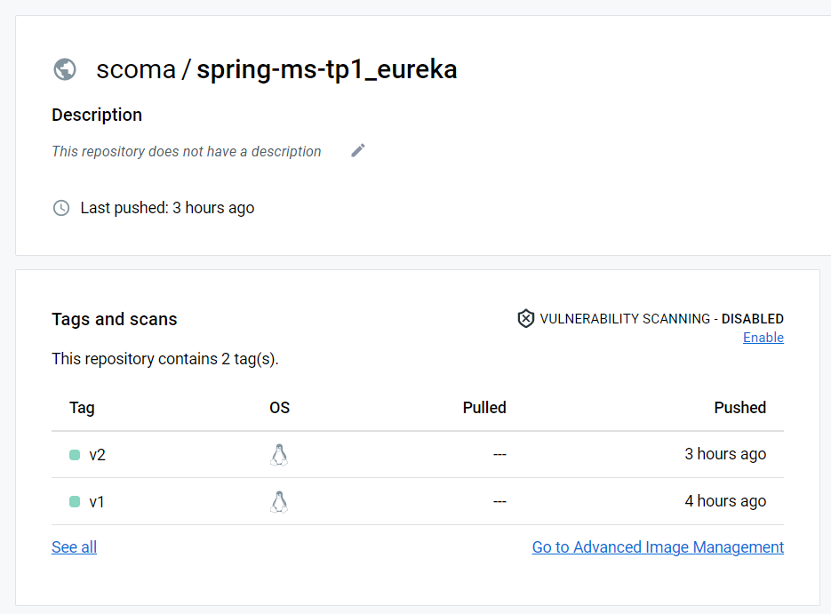

[👈 go back](./..)

# Create eureka discovery service

<br>

## stack & packages :

```
java : 17-Maven
spring : 2.7.5
packages : 
    - spring cloud : 2021.0.4
    - spring-cloud-starter-netflix-eureka-server
```
-> Have a look : [📦 pom.xml ](./pom.xml)

<br>

## Config : 

-> project configuration : `application.properties`

```
server.port=8761
eureka.client.fetch-registry=false
eureka.client.register-with-eureka=false
```
[⚙ application.properties ](./src/main/resources/application.properties)

<br>

## App : 

* This app has one single class, main class, that creates eureka server (annotation) :

```
@EnableEurekaServer
@SpringBootApplication
public class EurekaDiscoveryServiceApplication {
    public static void main(String[] args) {
        SpringApplication.run(EurekaDiscoveryServiceApplication.class, args);
    }
}
```

# Test the app : 

* after starting the app, open http://localhost:8761

<p align="center">
    
</p>

<br>

# Dockerizing the app : 

> Quick dockerize it with : `sh ./Dockerize.sh`

* docker file : [`Dockerfile`](./Dockerfile)

```
FROM openjdk:17.0.2

ENV APP_HOME=/usr/app
WORKDIR $APP_HOME
COPY ./target/*.jar app.jar
EXPOSE 8761
CMD [ "java", "-jar", "app.jar"]
```


<p align="center">
    
</p>

[image on DockerHub](https://hub.docker.com/r/scoma/spring-ms-tp1_eureka)


<br>

```< end.```