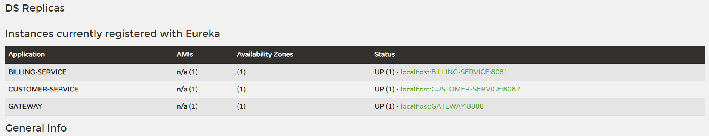

[👈 go back](./..)

# Create GateWay service

<br>

## stack & packages :

```
java : 17-Maven
spring : 2.7.5
packages : 
    - spring cloud : 2021.0.4
    - spring-cloud-starter-gateway
    - spring-cloud-starter-netflix-eureka-client
```
-> Have a look : [📦 pom.xml ](./pom.xml)

<br>

## Config : 

-> project configuration : `application.properties`

```
server.port=8888
spring.application.name=GATEWAY
spring.cloud.discovery.enabled=true
eureka.instance.prefer-ip-address=true
```
[⚙ application.properties ](./src/main/resources/application.properties)

<br>

## App : 

* This app has one single class, main class, it contains a bean to instanciate a `DiscoveryClientRouteDefinitionLocator` that is responsible for the dynamique routing of each microservice declared on eureka :

```
@SpringBootApplication
public class GatewayApplication {
    public static void main(String[] args) {
        SpringApplication.run(GatewayApplication.class, args);
    }
    @Bean
    DiscoveryClientRouteDefinitionLocator discoveryClientRouteDefinitionLocator(
            ReactiveDiscoveryClient reactiveDiscoveryClient, DiscoveryLocatorProperties discoveryLocatorProperties
    ){
        /*
            this enables dynamic routing, after registering the gateway to eureka, you can access each
            service by its name :
            localhost:<GATWAY_PORT>/<SERVICE-NAME>/<Service-route-path>
         */
        return new DiscoveryClientRouteDefinitionLocator(reactiveDiscoveryClient, discoveryLocatorProperties) ;
    }
}
```

<br>


# Test the app : 

* after starting the app to get it registred on eureka : 

<p align="center">
    
</p>

* The gateway routes successfully the request : 
<p align="center">
    
</p>

<br>


# Dockerizing the app : 

> Quick dockerize it with : `sh ./Dockerize.sh`

* docker file : [`Dockerfile`](./Dockerfile)

```
FROM openjdk:17.0.2

ENV APP_HOME=/usr/app
WORKDIR $APP_HOME
COPY ./target/*.jar app.jar
EXPOSE 8888
CMD [ "java", "-jar", "app.jar"]
```


<p align="center">
    
</p>

[image on DockerHub](https://hub.docker.com/r/scoma/spring-ms-tp1_gateway)


<br>

```< end.```